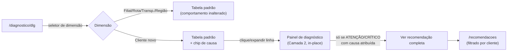

# Protótipo Funcional — v6.7.0 · Nova Dimensão "Cliente" no DLG

> **Etapa do processo**: Etapa 3 (Protótipo Funcional), conforme fluxo padrão de desenvolvimento do GD Frete Diagnóstico.
> **Entradas usadas**: `00_contexto_oficial.md`, `22_plano_diretor_tecnico.md`, `v6.7.0_validacao_estrategica.md`, `v6.7.0_PRD_dimensao_cliente.md` (Revisão 3), `v6.7.0_especificacao_tecnica_dimensao_cliente.md` (Revisão 3).
> **O que este documento NÃO faz**: não define arquitetura, não define nem reinterpreta regra de negócio (RN-xx), não propõe endpoint, schema ou migration novos — essas decisões já estão fechadas no PRD e na Especificação Técnica e são tratadas aqui como dados de entrada, não como objeto de discussão.
> **O que este documento faz**: traduz o escopo já aprovado (PRD §5–§11) em navegação, layout de tabela, apresentação de indicador, destaque de causa dominante, exibição de ranking, apresentação de recomendação e caminho de reuso no Relatório Executivo HTML — validando a experiência do analista **antes** da Etapa 4 (Especificação Técnica de implementação de UI) e da Etapa 5 (Implementação).
> Companion visual: [`v6.7.0_wireframe_dimensao_cliente.html`](v6.7.0_wireframe_dimensao_cliente.html) — mockup HTML de média fidelidade referenciado ao longo deste documento.

---

## Decisão de UX que organiza todo o protótipo

O PRD adiciona 8 campos novos (§5, linhas "novo") a uma tabela que já tem 14 colunas nas outras 4 dimensões. Empilhar tudo em colunas simultâneas quebraria CA-1 (a tela deve continuar reconhecível) e o próprio Princípio 5 do Contexto Oficial (produtividade do analista antes de superfície de produto).

**Decisão**: a tabela de Cliente usa **duas camadas de informação**, não uma tabela mais larga.

- **Camada 1 — Linha da tabela (sempre visível)**: os mesmos campos que Filial/Rota/Transportadora/Região já exibem, na mesma ordem, mais um indicador visual compacto de causa (chip), só para CRÍTICO/ATENÇÃO. Isso preserva CA-1 e CA-5 literalmente — quem já usa a tela para as outras 4 dimensões não precisa reaprender nada.
- **Camada 2 — Painel de diagnóstico (expansível, sob demanda)**: os 5 campos novos do PRD (§5, §6, §7, §10) mais o texto de diagnóstico causal completo, revelados ao expandir uma linha. Só existe conteúdo aqui para os clientes onde há algo a diagnosticar (ATENÇÃO/CRÍTICO) — para EFICIENTE, o expansor mostra apenas a composição do frete, sem seção de causa (RN-76 não se aplica).

Essa divisão é a resposta estrutural às 5 primeiras perguntas do pedido (navegabilidade, tabela, indicadores, causa dominante, rankings) — detalhadas abaixo por pergunta.

---

## Parte A — Descrição Funcional

### A.1 Navegabilidade

**Não existe tela nova, rota nova ou item de menu novo** — confirmado pela Validação Estratégica §2.3.3 e OBJ-3 do PRD. O fluxo de navegação é:

1. Analista acessa **Diagnóstico Logístico → Diagnóstico Logístico Analítico (DLG)**, rota `/diagnostico/dlg` (já existe).
2. No seletor de dimensão já existente (hoje: Filial | Rota | Transportadora | Região), aparece uma 5ª opção: **Cliente**. Nenhuma reordenação das 4 existentes.
3. Ao selecionar Cliente, a mesma tela recarrega a listagem via `GET /analitico?dimensao=CLIENTE_FINAL` (paginado, CA-16) — os filtros de período e classificação já existentes na tela continuam funcionando sem alteração de comportamento.
4. Cada linha da tabela é clicável/expansível (Camada 2) — não navega para outra URL, expande in-place. Isso evita duplicar a lógica de filtro/paginação em uma segunda tela.
5. A partir do painel expandido de um cliente CRÍTICO/ATENÇÃO com causa atribuída, um link secundário **"Ver recomendação completa"** leva à tela **Recomendações** (`/recomendacoes`, já existe) filtrada por aquele cliente — reaproveita a navegação e o componente de card de recomendação já existentes, não cria uma tela de detalhe de cliente.
6. Não há caminho de navegação que pressuponha ou aponte para um Portal do Cliente — consistente com Contexto Oficial §9 e Validação Estratégica §2.2.2.

Fluxo resumido:



### A.2 Comportamento e estados

| Estado | Comportamento |
|---|---|
| Carregando listagem | Skeleton da tabela (mesmo padrão visual já usado nas outras 4 dimensões) — nenhum padrão novo de loading introduzido. |
| Sem clientes no período | Estado vazio: "Nenhum cliente com CT-e no período selecionado." — mesma linguagem de vazio já usada nas outras dimensões, adaptada ao rótulo. |
| Cliente sem destinatário identificável | Aparece como linha "Cliente não identificado" (OBJ-5/CA-2) — nunca omitido, sem chip de causa (não há identidade para diagnosticar). |
| Cliente EFICIENTE | Sem chip de causa na Camada 1; ao expandir, Camada 2 mostra só composição de frete (informativo), sem seção "Causa Dominante" (RN-76 não roda para EFICIENTE). |
| Cliente ATENÇÃO/CRÍTICO, causa identificada | Chip de causa na Camada 1; Camada 2 completa, incluindo o texto de diagnóstico narrativo (mesmo texto usado na recomendação, §3.7 da Especificação Técnica). |
| Cliente ATENÇÃO/CRÍTICO, nenhuma causa identificada | Camada 1 mostra chip neutro "Sem causa específica" (não inventa causa — OBJ-9); Camada 2 mostra o texto genérico de desvio de benchmark já existente hoje (RN-25). |
| Cliente SEM_REF (sem benchmark configurado) | Comportamento já existente nas outras dimensões, sem mudança — chip de causa não aparece (não há desvio calculável sem referência). |
| Dado retroativo (CT-e pré-granularização do parser, §3.5) | Aviso discreto (tooltip/banner dispensável) na Camada 2, junto do gráfico de composição — nunca escondido (Especificação Técnica §5, CA-12). |
| Erro ao carregar | Mensagem de erro no padrão já existente da tela, com ação de retry — nenhum padrão novo. |

### A.3 Interações

- **Expandir/recolher linha**: clique no ícone de expansão ou na própria linha (fora de células de ordenação); ao expandir uma linha, as demais permanecem no estado em que estavam (múltiplas linhas podem estar expandidas simultaneamente) — o analista frequentemente compara 2–3 clientes lado a lado.
- **Ordenar (ranking)**: clique no cabeçalho de coluna ordenável ou seleção no dropdown de ranking já existente na tela, agora com os 2 critérios novos do PRD §8.
- **Filtrar por classificação/período**: filtros já existentes na tela, sem mudança de comportamento — CA-16 exige que esses filtros sejam aplicados server-side também para Cliente.
- **Copiar para Relatório Executivo**: ação futura, fora do escopo desta versão (PRD §13) — o protótipo já organiza a Camada 2 como um bloco autocontido pensando nesse reuso (ver A.5 abaixo), mas nenhuma ação de "copiar/exportar" é implementada nesta versão.

### A.4 Como a causa dominante é destacada

Dois níveis de destaque, propositalmente escalonados — visão rápida (scan) vs. explicação completa (leitura):

1. **Nível scan (Camada 1)**: um **chip pequeno de causa**, posicionado imediatamente ao lado do chip de Classificação já existente (Crítico/Atenção/Eficiente) — mesma linha, mesma altura visual, para que o analista veja "cliente crítico" e "por quê" no mesmo golpe de vista, sem abrir nada. Vocabulário do chip (direto, sem jargão técnico):
   - 📦 **Adicionais** — causa = componentes adicionais
   - 🔀 **Fragmentação** — causa = fragmentação operacional
   - ⚠️ **Ambas** — as duas causas presentes
   - Sem chip — EFICIENTE, SEM_REF, ou nenhuma causa específica identificada (Camada 2 explica qual dos três casos é, para não confundir "sem chip" com "sem problema")
2. **Nível explicação (Camada 2)**: ao expandir, o texto narrativo completo (mesmo gerado para a recomendação — nenhuma duplicação de redação) aparece em destaque tipográfico (não é mais um chip, é a frase real, ex. *"possui R$/kg acima do benchmark principalmente devido ao excesso de despachos"*), acompanhado dos números que a sustentam (% adicionais, componente ofensor, quantidade de despachos em janela curta) — nunca só a conclusão sem o dado de apoio, para o analista poder validar antes de repassar ao cliente (Validação Estratégica §2.2.1: "analista valida o diagnóstico antes de apresentar").

A cor do chip **não** introduz uma paleta nova de classificação — usa variações do mesmo sistema de cor já usado para Crítico/Atenção/Eficiente (ex. tom de alerta para causa presente, neutro para ausente), evitando uma sexta escala de cor coexistindo com as 5 já existentes (mesmo princípio do PRD §9).

### A.5 Reutilização futura no Relatório Executivo HTML

O Contexto Oficial (§7, §10) e o Plano Diretor (§18) exigem que toda funcionalidade nova do motor analítico já nasça pensando na apresentação no Relatório Executivo, e que a apresentação reutilize componente, não duplique camada. Duas decisões deste protótipo já preparam esse reuso, sem implementá-lo agora (fora de escopo da v6.7.0, PRD §13):

1. **A Camada 2 é desenhada como um bloco autocontido** ("Cartão de Diagnóstico do Cliente": composição em pizza + causa + texto narrativo + números de apoio) — exatamente a unidade de conteúdo que uma seção "Diagnóstico por Cliente" do Relatório Executivo precisaria, cliente a cliente. Isso não é uma decisão de arquitetura nova; é desenhar a UI de forma que o componente que a Etapa 5 (Implementação) construir já sirva a dois contextos (tela DLG e, futuramente, relatório) sem refatoração de layout.
2. **O gráfico de composição reaproveita `GraficosDiagnostico.jsx`**, já usado no Dashboard e — por extensão, quando o Relatório Executivo desenhar sua seção financeira — o mesmo componente de pizza que já é renderizado lá (Especificação Técnica §5). Isso segue literalmente a diretriz do Plano Diretor §18: "a plataforma deve reutilizar componentes existentes... em vez de construir uma camada de apresentação paralela por módulo".

Quando a Etapa 1 (Análise) de uma futura versão priorizar a seção de Cliente no Relatório Executivo, o ponto de partida já é o Cartão de Diagnóstico validado aqui — não um novo protótipo do zero.

---

## Parte B — Wireframes

Ver arquivo companion **[`v6.7.0_wireframe_dimensao_cliente.html`](v6.7.0_wireframe_dimensao_cliente.html)** (mockup HTML interativo, média fidelidade, clicável — expandir/recolher linha e trocar critério de ranking funcionam de fato no navegador, sem backend).

Fluxo de navegação: ver diagrama Mermaid na seção A.1.

Estrutura da tabela (Camada 1 + Camada 2), representada em texto:

```
┌─────────────────────────────────────────────────────────────────────────┐
│ [Filial] [Rota] [Transportadora] [Região] [● Cliente]   Período ▾  Class ▾│
├─────────────────────────────────────────────────────────────────────────┤
│ Ordenar por: [Maior custo de frete ▾]  ← inclui os 2 critérios novos     │
├─────────────────────────────────────────────────────────────────────────┤
│ ▸ Cliente          Classif.        R$/Kg   Benchmark  %Frete  Impacto ...│
│ ▸ Distribuidora XPTO  🔴Crítico 📦Adicionais  4,82      3,10    38%   R$18.4k│
│ ▾ Comércio Beta S.A.  🔴Crítico 🔀Fragmentação 4,55     3,10    31%   R$14.9k│
│   ┌───────────────────────────────────────────────────────────────────┐ │
│   │ CAMADA 2 — Diagnóstico de Comércio Beta S.A.                      │ │
│   │ [pizza: Frete Peso/Valor · Pedágio · GRIS · TDE · TDA · Estadia..]│ │
│   │ Frete Transp. Principal: R$32.100   Adicionais: R$8.900 (28%)      │ │
│   │ Componente ofensor: TDE (R$5.200), TDA (R$2.100)                   │ │
│   │ Sinal de fragmentação: 12 despachos em janelas ≤5 dias              │ │
│   │ "gerou 12 despachos no período com peso médio 60% abaixo do        │ │
│   │  padrão da empresa... sinal de fragmentação operacional"           │ │
│   │ ⓘ CT-e antes de mar/2026 podem ter TDE/TDA agrupados em "Outros"   │ │
│   │ [Ver recomendação completa →]                                      │ │
│   └───────────────────────────────────────────────────────────────────┘ │
│ ▸ Indústria Gama       🟡Atenção ⚠️Ambas       3,60      3,10    22%   R$6.1k │
│ ▸ Cliente não identificado                    3,05      3,10    18%   —     │
│ ▸ Comércio Delta Ltda  —Eficiente   —          2,90       —     15%   —     │
└─────────────────────────────────────────────────────────────────────────┘
```

---

## Parte C — Especificação da Interface (por elemento de tela)

### C.1 Seletor de dimensão

- **Componente**: o já existente em `DiagnosticoDLG.jsx` (tabs ou dropdown, conforme implementação atual) — apenas ganha uma 5ª opção "Cliente".
- **Estado selecionado**: mesmo padrão visual das 4 opções existentes (nenhum destaque diferenciado para a opção nova, para não sinalizar "funcionalidade beta").

### C.2 Filtros

- **Período**: componente já existente, sem alteração de comportamento.
- **Classificação** (Crítico/Atenção/Eficiente): já existente na tela; passa a ser aplicado **server-side** para Cliente (CA-16/Especificação Técnica §6), diferença invisível ao analista — a UI não muda, só o desempenho.
- Nenhum filtro novo é introduzido nesta versão (ex. não há filtro dedicado "só com sinal de fragmentação" — esse recorte é feito via ranking, ver C.4).

### C.3 Grid / Tabela — Camada 1

Colunas, na ordem, idêntica à ordem já usada pelas outras 4 dimensões (preserva CA-1):

Cliente · Classificação (chip + **chip de causa**, novo) · R$/Kg · Benchmark · % Frete · Valor do Frete · Valor da Mercadoria · Peso · Qtd. CT-es/Entregas · Ticket Médio · Peso Médio · Distância Média (sempre "indisponível", texto cinza, sem tooltip de erro) · Impacto Financeiro Potencial.

- **Chip de causa**: só renderizado quando `causa_dominante` não é nulo (ou seja, só ATENÇÃO/CRÍTICO). Ícone + rótulo curto (ver A.4). Truncamento: nunca — o rótulo é sempre uma das 4 opções fixas, cabe em qualquer largura de coluna.
- **Ícone de expansão**: à esquerda da coluna Cliente (▸/▾), padrão de tabela expansível já eventualmente usado em outras telas da plataforma (reaproveitar componente, não criar um novo padrão de expansor).
- **Ordenação por coluna**: clique no cabeçalho ordena por aquela coluna — comportamento já existente, estendido às colunas novas quando aplicável (Impacto Financeiro Potencial já é ordenável hoje).
- **Densidade**: mesma densidade de linha das outras 4 dimensões — a Camada 2 é o lugar para densidade extra, não a linha em si.

### C.4 Ranking (ordenação)

- **Controle**: mesmo controle de ordenação já usado hoje (dropdown ou clique de cabeçalho — conforme padrão real da tela).
- **Critérios**, na ordem do PRD §8, os 5 já existentes primeiro, os 2 novos ao final da lista (para não deslocar a posição dos critérios já conhecidos pelo analista):
  1. Maior custo de frete
  2. Maior % frete
  3. Maior R$/Kg
  4. Maior impacto financeiro potencial
  5. Maior volume movimentado
  6. **Maior % de componentes adicionais** *(novo)*
  7. **Maior sinal de fragmentação** *(novo)* — ao selecionar, a tabela filtra implicitamente para clientes com `sinal_fragmentacao = true`, ordenados por impacto financeiro (PRD §8); um texto auxiliar abaixo do dropdown informa isso ("mostrando apenas clientes com sinal de fragmentação ativo") para o filtro implícito não parecer um bug de contagem.

### C.5 Painel de diagnóstico — Camada 2 (Cartão de Diagnóstico do Cliente)

Conteúdo, nesta ordem:

1. **Gráfico de composição do frete** — pizza, componente `GraficosDiagnostico.jsx` reaproveitado, categorias RN-05/RN-73 (Frete Peso, Frete Valor, TDE, TDA, Estadia, Pedágio, GRIS, Seguro, Ademe, Despacho, Outros).
2. **Linha de métricas de composição**: Frete Transporte Principal (R$) · Componentes Adicionais (R$ e %) · Componente(s) ofensor(es) (top-1 ou top-2 do ranking de componentes).
3. **Bloco de fragmentação** (só se `sinal_fragmentacao = true`): quantidade de despachos, janela de dias, comparação de peso médio vs. mediana da empresa.
4. **Texto de diagnóstico causal** (só se `causa_dominante` preenchido): frase completa no padrão do PRD §10/§11 — mesmo texto da recomendação, nunca uma segunda redação.
5. **Aviso de retroatividade** (condicional, só quando a empresa tem CT-e anteriores à granularização do parser): texto discreto, não modal, não bloqueia leitura do restante do painel.
6. **Link "Ver recomendação completa →"** (só se há recomendação gerada para esse cliente) — leva a `/recomendacoes` filtrado.

Estado vazio da Camada 2 (cliente EFICIENTE): mostra apenas o item 1 e 2 acima (composição, sem seção de causa) — texto de apoio: "Este cliente está dentro do benchmark; nenhum diagnóstico causal aplicável."

### C.6 Recomendações (`Recomendacoes.jsx`)

- **Nenhuma tela nova** — a dimensão Cliente gera cards no mesmo formato já usado para as recomendações de Rota (RN-56), na mesma listagem.
- **Conteúdo do card**: segue literalmente a tabela de gatilhos do PRD §11 (nome do cliente em negrito, causa, números de apoio, impacto financeiro em R$) — o protótipo não introduz um layout de card novo, herda o já existente.
- **Ordenação/priorização dos cards**: já existente na tela (RN-71/RN-77 definem quais clientes entram — top-5 CRÍTICO por desvio, top-3 SEM_REF — a UI apenas lista o que o backend retorna, sem lógica de priorização própria no frontend).
- **Rastreabilidade de volta à Camada 2**: cada card de recomendação de Cliente inclui um link **"Ver na dimensão Cliente"** que volta a `/diagnostico/dlg` com a dimensão Cliente e aquele cliente já expandido (Camada 2 aberta) — fecha o ciclo diagnóstico ↔ recomendação nos dois sentidos.

### C.7 Mensagens, estados vazios e responsividade

- Mensagens seguem o vocabulário já definido no Contexto Oficial e nos textos do PRD §11 — nenhuma redação nova além da já aprovada (ex. nunca "pedido fragmentado", §4.2 do PRD).
- **Responsividade**: em telas estreitas, a Camada 1 prioriza Cliente, Classificação+chip de causa, R$/Kg e Impacto Financeiro Potencial (colunas de decisão rápida); as demais colunas ficam roláveis horizontalmente — mesmo padrão de responsividade já usado nas outras 4 dimensões, sem comportamento novo por dimensão.
- **Erro de carregamento do painel expandido** (ex. falha ao calcular fragmentação sob demanda, conforme risco descrito na Especificação Técnica §6 sobre a Parte B assíncrona): mensagem de erro local ao painel, com retry — não derruba a tabela inteira.

---

## Rastreabilidade deste protótipo

| Pergunta respondida | Seção deste documento | Requisito de origem |
|---|---|---|
| Navegabilidade | A.1 | OBJ-3, Validação §2.3.3, CA-1 |
| Organização da tabela | Decisão de UX (topo), C.3 | PRD §5, CA-1, CA-3 |
| Apresentação dos indicadores | C.3, C.5 | PRD §5, §6, §7 |
| Destaque da causa dominante | A.4, C.3, C.5 | PRD §10, RN-76, OBJ-8/OBJ-9 |
| Exibição dos rankings | C.4 | PRD §8 |
| Apresentação das recomendações | C.6 | PRD §11, RN-77 |
| Reuso no Relatório Executivo HTML | A.5 | Contexto Oficial §7/§18, Plano Diretor §18 |

*Protótipo elaborado a partir de PRD e Especificação Técnica já aprovados (Revisão 3). Nenhuma decisão de arquitetura, schema, RN ou endpoint foi tomada ou alterada neste documento — apenas tradução do escopo aprovado em experiência de tela.*
